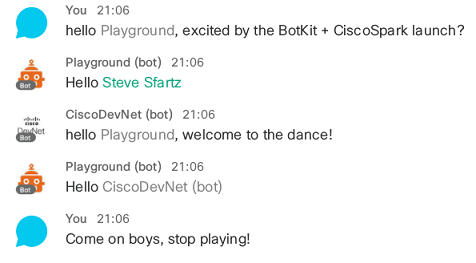
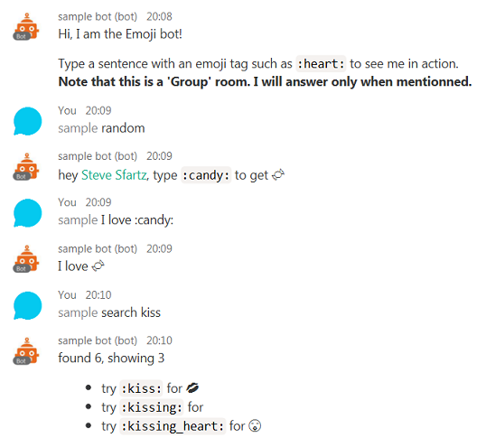
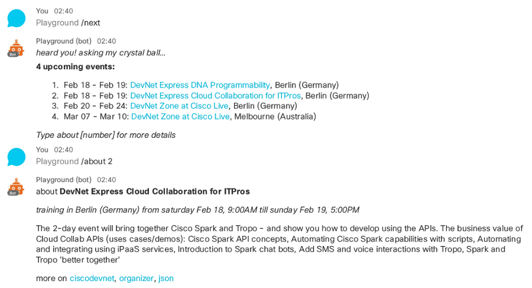

# BotKit samples for Cisco Spark

Assuming your bot is accessible from the internet or you exposed it via a tunnelling tool such as [ngrok](https://ngrok.com),
you can run any sample in a snatch:

From a bash shell, type:

```shell
> git clone https://github.com/CiscoDevNet/botkit-ciscospark-samples
> cd botkit-ciscospark-samples
> npm install
> SPARK_TOKEN=0123456789abcdef PUBLIC_URL=https://abcdef.ngrok.io SECRET="not that secret" node helloworld.js
```

From a windows shell, type:

```shell
> git clone https://github.com/CiscoDevNet/botkit-ciscospark-samples
> cd botkit-ciscospark-samples
> npm install
> set SPARK_TOKEN="0123456789abcdef"
> set PUBLIC_URL="https://abcdef.ngrok.io"
> set SECRET="not that secret"
> node helloworld.js
```

where:

- SPARK_TOKEN is the API access token of your Cisco Spark bot
- PUBLIC_URL is the root URL at which Cisco Spark can reach your bot
- SECRET is the secret that Cisco Spark uses to sign the JSON webhooks events posted to your bot
- [ngrok](http://ngrok.com) helps you expose the bot running on your laptop to the internet, type: `ngrok http 8080` to launch

**New to BotKit?**
Read the [BotKit for CiscoSpark Guide](https://github.com/howdyai/botkit/blob/master/docs/readme-ciscospark.md)

**New to CiscoSpark?**
Read the [Starter Guide](https://github.com/ObjectIsAdvantag/hackathon-resources#cisco-spark-starter-guide-chat-calls-meetings) we use at hackathon. Or go straight to [Spark4Devs](https://developer.ciscospark.com), signin and click [My apps](https://developer.ciscospark.com/apps.html) to create a bot account.


## Hello World

Simplest bot [you can code](helloworld.js#L62): simply echoes a message with a mention of the Cisco Spark user that mentionned him.


And don't forget to mention him in group rooms.


Note that the bot will respond to anyone mentioning him,
then no reason why he could not chat with other bots.
Below, the Hello bot (impersonnated via the Playground bot token) helling the CiscoDevNet bot.




## Emoji

This [bot turns emoji tags](emoji.js#58) to unicode characters and posts back the 'emojified' phrase

The bot leverages the [experimental websocket library for CiscoSpark](https://github.com/marchfederico/ciscospark-websocket-events),
so that you don't need to register a Webhook onto CiscoSpark, and expose your bot in the internet.

From a bash shell, type:

```shell
> npm install
> SPARK_TOKEN=0123456789abcdef node emoji.js
```

From a Windows shell, type:

```shell
> npm install
> set SPARK_TOKEN="0123456789abcdef"
> node emoji.js
```




## CiscoDevNet events

This bot illustrates how you can [create conversations](devnet.js#L117),
and calls an external API hosted on Heroku that lists current and upcoming events at DevNet.


