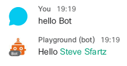
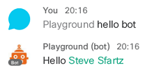

# BotKit samples for Cisco Spark

Run each sample in a snatch by setting up yout bot environment variables from the command line:

```shell
> git clone https://github.com/CiscoDevNet/botkit-ciscospark-samples
> cd botkit-ciscospark-samples
> npm install
> SPARK_TOKEN=0123456789abcdef PUBLIC_URL=https://abcdef.ngrok.io SECRET="not that secret" node helloworld.js
```

where:

- SPARK_TOKEN is the API access token of your Cisco Spark bot
- PUBLIC_URL is the root URL at which Cisco Spark can reach your bot
- SECRET is the secret that Cisco Spark uses to sign the JSON webhooks events posted to your bot
- [ngrok](http://ngrok.com) is the tunnel engine that will expose your bot on the internet, type: `ngrok http 8080` to launch

New to CiscoSpark? 
Read the [Starter Guide](https://github.com/ObjectIsAdvantag/hackathon-resources#cisco-spark-starter-guide-chat-calls-meetings) we use at hackathon.

Don't have a Cisco Spark bot account?
Go straight to [Spark4Devs](https://developer.ciscospark.com), signin and click [My apps](https://developer.ciscospark.com/apps.html) to create a bot account.


## Hello World bot

Simplest bot you can run, simply echoes a message with a mention of the Cisco Spark user.



And don't forget to mention him in group rooms.



Note that the hello bot will respond to any mentions,
no reason why he could not chat with other bots.
Below, the Hello bot (impersonnated via the Playground bot token) helling the CiscoDevNet bot.


## CiscoDevNet events bot

The bot illustrates how you can create conversations in Cisco Spark thanks to BotKit.
It requests an external API hosted on Heroku that lists current and upcoming events at DevNet.

Here is a version of the bot.


